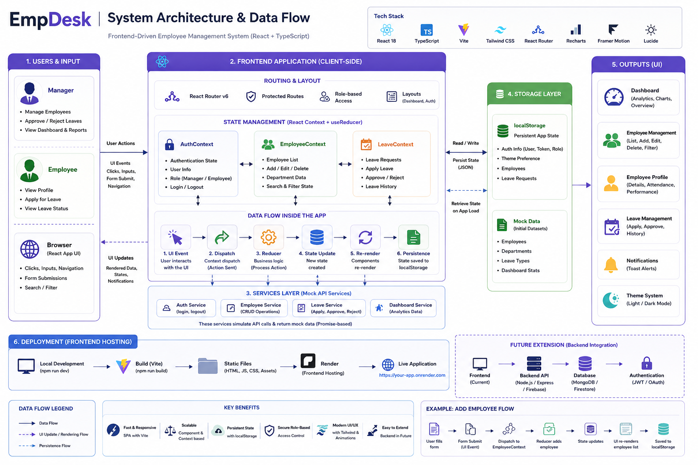

# 🚀 EmpDesk — Employee Management System

A modern, scalable, and fully responsive **Employee Management Dashboard** built with **React, TypeScript, and Tailwind CSS**, designed to streamline employee operations with a clean UI and modular architecture.



---

## 🧭 Overview

EmpDesk is a frontend-driven Employee Management System focused on **clarity, performance, and scalability**. It models real-world HR workflows including employee management, leave tracking, and role-based access control.

---

## ✨ Features

### 🔐 Authentication & Role-Based Access

* Manager and Employee roles
* Protected routes and conditional UI rendering
* Professional split-layout login with branded design

### 👨‍💼 Employee Management

* Add, edit, delete employees with full-page forms
* Structured employee profiles with multiple sections
* Department-based organization
* Optimized table layout with proper column spacing
* Horizontal scrollbar for large datasets

### 📊 Dashboard & Analytics

* Key metrics overview
* Department distribution charts
* Recent activity tracking
* Dynamic performance charts that update based on selected employee
* Varied performance ratings (Excellent, Good, Average, Poor) with color-coded badges
* Interactive employee selection with visual feedback

### 🗓️ Events Management

* Create, edit, and delete company events
* Event categorization (meetings, deadlines, social, training)
* Category icons and visual hierarchy
* Date synchronization with calendar

### 🧾 Leave Management

* Apply for leave
* Approve / reject requests (Manager)
* Track leave history

### 👤 Profile System

* Personal profile view
* Attendance and performance tracking
* Role-specific sections (skills, competencies for managers)
* Activity status and login tracking

### 🔎 Search & Filtering

* Real-time search with friendly "no results" messaging
* Department-based filtering
* Dynamic search feedback

### 🎨 UI/UX

* Fully responsive (mobile → desktop)
* Dark & Light mode with smooth transitions
* Modern, branded UI with reusable components
* Improved 404 page with navigation options
* Enhanced event cards with icons and animations
* Professional login interface with split-layout design

---

## 📝 Recent Updates (v1.3)

### Bug Fixes & Stability Improvements
* **Button Component Error**: Fixed missing Button import in AddEmployeePage causing 'Button is not defined' error
* **Pagination Restoration**: Restored full pagination functionality with numbered buttons, prev/next navigation, and results counter
* **Table Spacing Enhancement**: Improved column spacing with px-6 padding and min-width constraints for better layout stability
* **Horizontal Scrollbar**: Added inner scrollable container for table overflow ensuring proper scrolling without breaking layout
* **Performance Ratings Fix**: Enhanced mock data generation to produce genuinely varied scores resulting in all rating types (Excellent, Good, Average, Poor)

### Previous Updates (v1.2)
* **Employee List**: Fixed S.L and EMP ID column spacing with proper widths
* **Performance Ratings**: Implemented color-coded rating system
* **Button Components**: Replaced old buttons with custom Button component
* **Edit Employee Layout**: Restructured full-page form with organized sections
* **Form Consistency**: Unified form structure and styling

### Earlier Updates (v1.1)
* **Events Page**: Fixed date synchronization bug, removed duplicate buttons, revamped UI with category icons
* **Profile Pages**: Added Skills & Expertise, Performance Insight, and Activity Status sections
* **Performance Module**: Implemented dynamic chart updates when selecting employees
* **Login Page**: Redesigned with professional split-layout (40% brand panel, 60% form)
* **404 Page**: Improved with branded design and helpful navigation
* **Search Feedback**: Enhanced empty state messaging across the app

---

## 🛠 Tech Stack

| Category         | Technology                   |
| ---------------- | ---------------------------- |
| Frontend         | React 18 + Vite + TypeScript |
| Styling          | Tailwind CSS + CSS Variables |
| State Management | React Context + useReducer   |
| Routing          | React Router v6              |
| Animations       | Framer Motion                |
| Charts           | Recharts                     |
| Icons            | Lucide React                 |
| Notifications    | react-hot-toast              |

---

## ⚙️ Architecture

### 1. State Management (Context-Based)

* `AuthContext` → Handles authentication & roles
* `EmployeeContext` → Employee data management
* `LeaveContext` → Leave workflows

✔ Lightweight alternative to Redux
✔ Clean separation of concerns

---

### 2. Component Design

* Reusable UI components (Card, Button, Modal, etc.)
* Clear separation between UI and logic
* Scalable folder structure

---

### 3. Theming System

* CSS Custom Properties (`--bg`, `--text`, etc.)
* Persistent theme (localStorage)
* Smooth transitions across all components

---

## 📁 Project Structure

```
src/
├── components/        # Reusable UI components
├── context/           # Global state (Auth, Employee, Leave)
├── hooks/             # Custom hooks
├── layouts/           # Layout wrappers (Dashboard, Auth)
├── pages/             # Main pages
├── services/          # Mock API layer
├── types/             # TypeScript definitions
├── utils/             # Helpers & mock data
├── constants.ts
└── index.css          # Global styles
```

---

## 🚀 Getting Started

### Prerequisites

* Node.js (v18+)

### Installation

```bash
# Clone the repository
git clone https://github.com/maliha63/empdesk.git

# Navigate to project
cd empdesk

# Install dependencies
npm install

# Run development server
npm run dev
```

Open: **http://localhost:5173**

---

## 📊 Data Handling

* Mock employee dataset
* LocalStorage for persistence (leave requests, theme)
* Simulated real-time updates

---

## 📸 Key Pages

* Dashboard — analytics & overview
* Employees — full CRUD interface
* Employee Profile — detailed view
* My Profile — personal dashboard
* Add/Edit Employee — validated forms

---

## 🔮 Future Improvements

* Backend integration (Node.js / Firebase)
* Real authentication (JWT / OAuth)
* Database (MongoDB / Firestore)
* Attendance tracking system
* Payroll module
* Notifications system
* API abstraction layer
* Unit & integration testing

---

## 🤝 Contributing

1. Fork the repository
2. Create a feature branch
3. Commit your changes
4. Open a pull request

---

## 📄 License

MIT License


